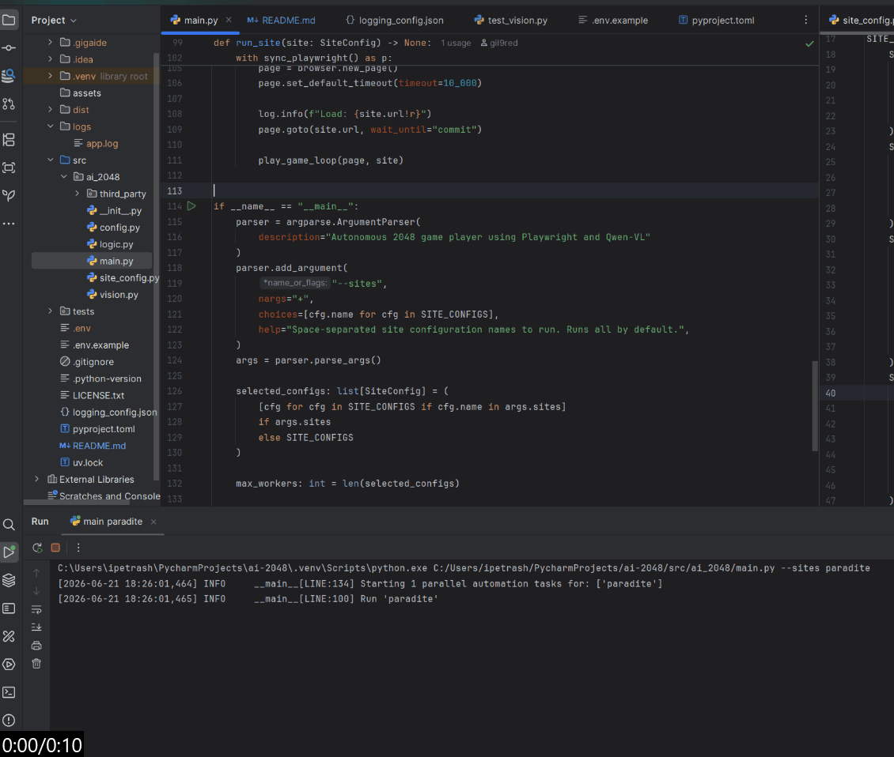
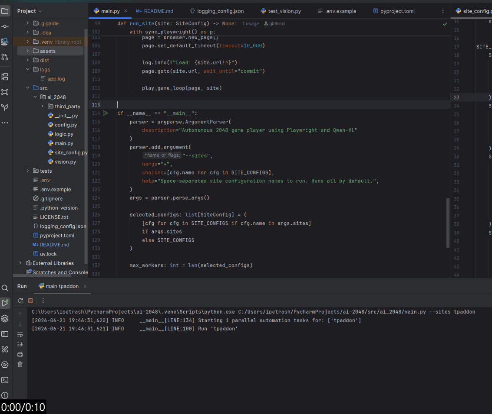
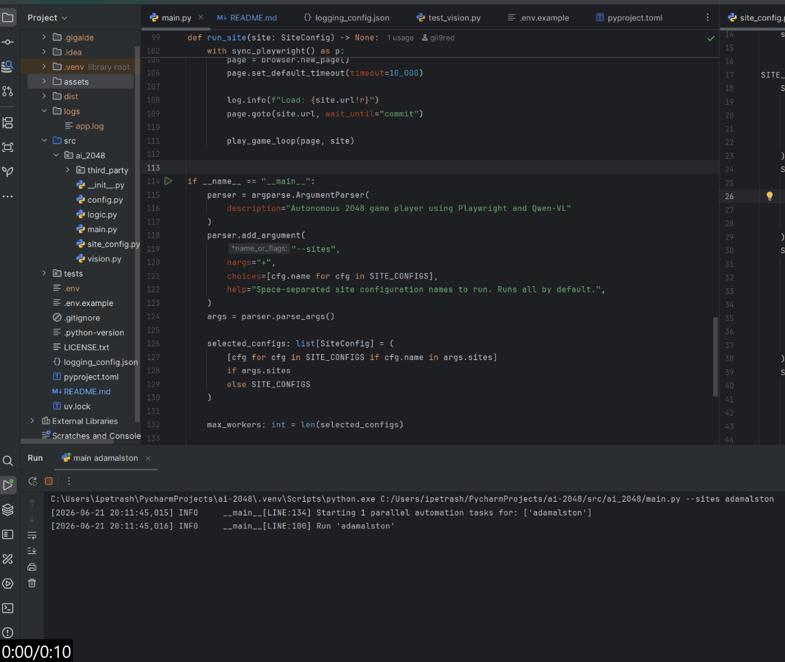
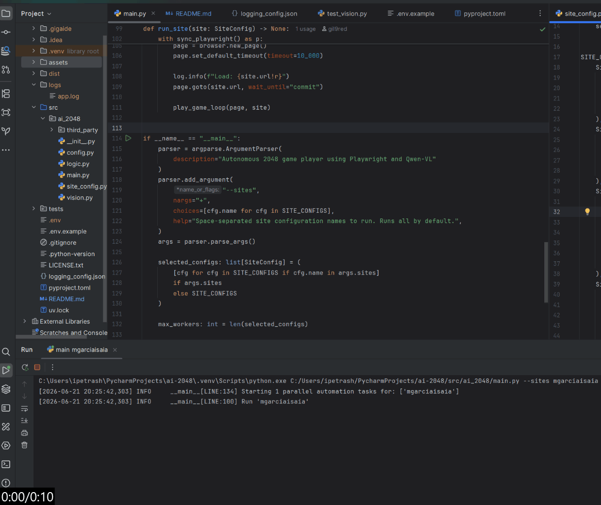

# AI 2048

An autonomous 2048 game bot that plays in the browser via `Playwright` and uses the `Qwen Vision-Language Model (VLM)` for grid recognition.

## Demo (GIF)

<details>
<summary><b>paradite</b></summary>
<br/>


</details>

<details>
<summary><b>tpaddon</b></summary>
<br/>
   

</details>

<details>
<summary><b>adamalston</b></summary>
<br/>


</details>

<details>
<summary><b>mgarciaisaia</b></summary>
<br/>


</details>

## Prerequisites

The project uses [Ollama](https://ollama.com) to run the vision model locally. Make sure Ollama is installed and running on your system, then pull the required model (ensure this matches the `OLLAMA_MODEL` variable in your `.env` file):

### Local Setup (127.0.0.1)
If Ollama is running on the same machine as this bot, simply pull the required model (ensure this matches the `OLLAMA_MODEL` variable in your `.env` file):
```bash
ollama pull qwen3.5:9b
```

### Remote Setup (Custom Server IP / Port)
If Ollama is hosted on a remote server (e.g., `http://192.168.1.50:11434`), pass the remote host address to the CLI before pulling the model:
```bash
# On Linux/macOS
OLLAMA_HOST="http://192.168.1.50:11434" ollama pull qwen3.5:9b

# On Windows (Command Prompt)
set OLLAMA_HOST=http://192.168.1.50:11434 && ollama pull qwen3.5:9b

# On Windows (PowerShell)
\$env:OLLAMA_HOST="http://192.168.1.50:11434"; ollama pull qwen3.5:9b
```

## Installation

1. Clone the repository:
   ```bash
   git clone https://github.com/gil9red/ai-2048
   cd ai-2048
   ```

2. Create and activate a virtual environment:
   ```bash
   # On Linux/macOS
   python3 -m venv .venv
   source .venv/bin/activate

   # On Windows (Command Prompt)
   python -m venv .venv
   .venv\Scripts\activate

   # On Windows (PowerShell)
   python -m venv .venv
   .venv\Scripts\Activate.ps1
   ```

3. Install the dependencies defined in [pyproject.toml](pyproject.toml):
   ```bash
   pip install .
   ```

4. Install the `Firefox` browser binaries required by `Playwright`:
   ```bash
   python -m playwright install firefox
   ```

## Configuration

The project uses environment variables managed via a `.env` file and logging configurations defined in [logging_config.json](logging_config.json).

If no `.env` file is present, the application will automatically create one from [.env.example](.env.example) upon the first launch. You can also copy it manually before starting:

```bash
# On Linux/macOS
cp .env.example .env

# On Windows (Command Prompt)
copy .env.example .env

# On Windows (PowerShell)
Copy-Item .env.example .env
```

### Environment Variables

Review and adjust the variables inside `.env` if necessary:

* `OLLAMA_URL`: The URL where your local Ollama instance is running (default: `http://127.0.0.1:11434`).
* `OLLAMA_MODEL`: The specific model version to use (default: `qwen3.5:9b`).
* `LOG_LEVEL`: Severity level for console logging output (e.g., `INFO`, `WARNING`).
* `FILE_LOG_LEVEL`: Severity level for file logging output inside the `logs/` directory (default: `DEBUG`).

## Usage

Execute the module from the root directory. Since the project uses a `src/` layout, explicitly provide the `src` path to `PYTHONPATH` if the package was not installed in editable mode.

### Run All Sites (Default)
By default, the script will run parallel automation tasks for all configured sites:

```bash
# On Linux/macOS
PYTHONPATH=src python -m ai_2048.main

# On Windows (Command Prompt)
set PYTHONPATH=src && python -m ai_2048.main

# On Windows (PowerShell)
\$env:PYTHONPATH="src"; python -m ai_2048.main
```

### Run Specific Sites
To run only selected sites, append the `--sites` flag with space-separated configuration names:

```bash
# On Linux/macOS
PYTHONPATH=src python -m ai_2048.main --sites paradite mgarciaisaia

# On Windows (Command Prompt)
set PYTHONPATH=src && python -m ai_2048.main --sites paradite mgarciaisaia

# On Windows (PowerShell)
\$env:PYTHONPATH="src"; python -m ai_2048.main --sites paradite mgarciaisaia
```

### Help and Available Configurations
To view the description and the full list of available site configurations, run:

```bash
# Example for Linux/macOS
PYTHONPATH=src python -m ai_2048.main --help

# On Windows (Command Prompt)
set PYTHONPATH=src && python -m ai_2048.main --help

# On Windows (PowerShell)
\$env:PYTHONPATH="src"; python -m ai_2048.main --help
```

## Running Tests

To run the vision test suite inside `tests/test_vision.py` using the standard Python test runner, execute the following command from the root directory:

```bash
# On Linux/macOS
PYTHONPATH=src python -m unittest tests/test_vision.py

# On Windows (Command Prompt)
set PYTHONPATH=src && python -m unittest tests/test_vision.py

# On Windows (PowerShell)
\$env:PYTHONPATH="src"; python -m unittest tests/test_vision.py
```

## License

This project is licensed under the MIT License - see the [LICENSE.txt](LICENSE.txt) file for details.
